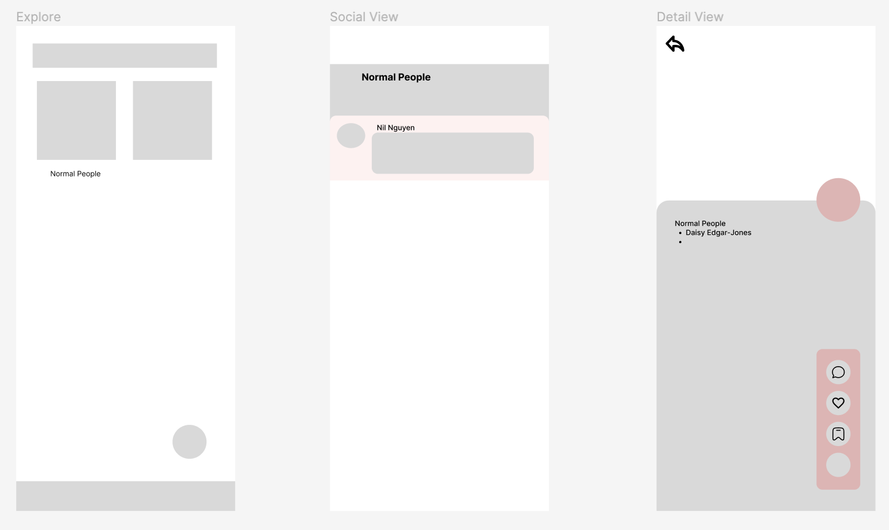

# movie-night

Android app, to browse, jam over movies

## Features

1. View list of movies, and details
2. Save to watch list
3. Write review
4. Subscribe to the movie to receive latest updates
5. Search for movies
6. Watch trailers (YouTube embeded view)
7. Share to other apps
8. Connect to friends
9. See number of friends watched the movie

## Nuts and bolts

- Using Kotlin, ViewBinding, DataBinding
- Navigation Graph
- Room
- Flow
- [Anticipated] GraphQL

## Demo

Wireframe: detail, list view.

Day 1: Project setups, Detail view.

| Detail View Day 1 | List View Day 2 | Detail View Day 2|
|--|--|--|
||||
